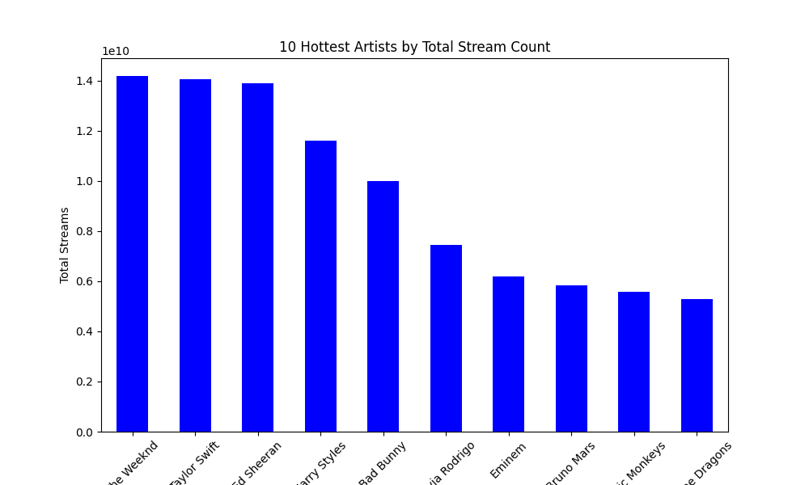

# Mini_Project_3

This is the README for my Mini Project 3 for the IDS706 - Data Engineering Systems class at Duke University.

## Dataset
The dataset comes from Kaggle, a public machine learning and data science community. It contains a CSV file of detailed information regarding the most-streamed Spotify songs in 2023. Link: https://www.kaggle.com/datasets/nelgiriyewithana/top-spotify-songs-2023/data

## Techniques Applied
In addition to [Pandas](https://pandas.pydata.org/) for convenience with drawing figures, I have integrated [Polars](https://pola.rs) for more convenience in data preparation. Compared to Pandas, Polars is faster and more expressive in terms of mimicking the behaviors of data wranling syntax.

## Data Visualization
For the visualization, I analyzed and visualized the 10 hottest artists by their stream counts.

## Summary Statistics
Here is a glimpse into the summary statistics for certain columns from the dataset by running `dataframe.describe()`:

## Extra Credit
If you examine the [latest commit by the actions-user](https://github.com/nogibjj/Peter_Min_Data_Engineering_Project2/commit/e7de39b32bb070d74214b7c3c92f5762dc1d3733) in GitHub, you will see that both the HTML descriptive data analytics file from the `ProfileReport` and the markdown descriptive statistics file are built automatically at each push from the CI/CD pipeline. PDF file format is not supported by this package so HTML has to be used here.
